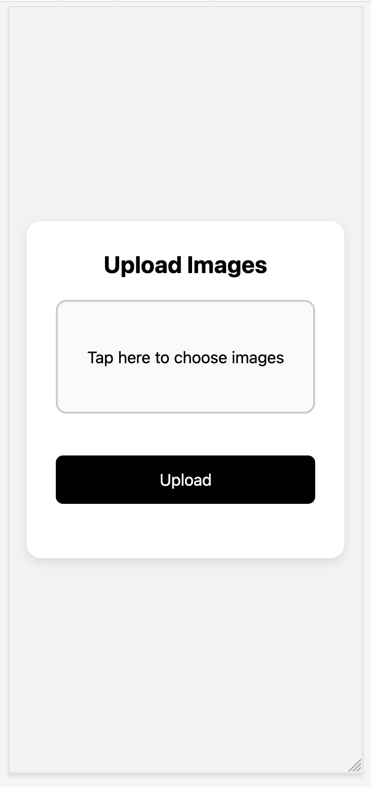
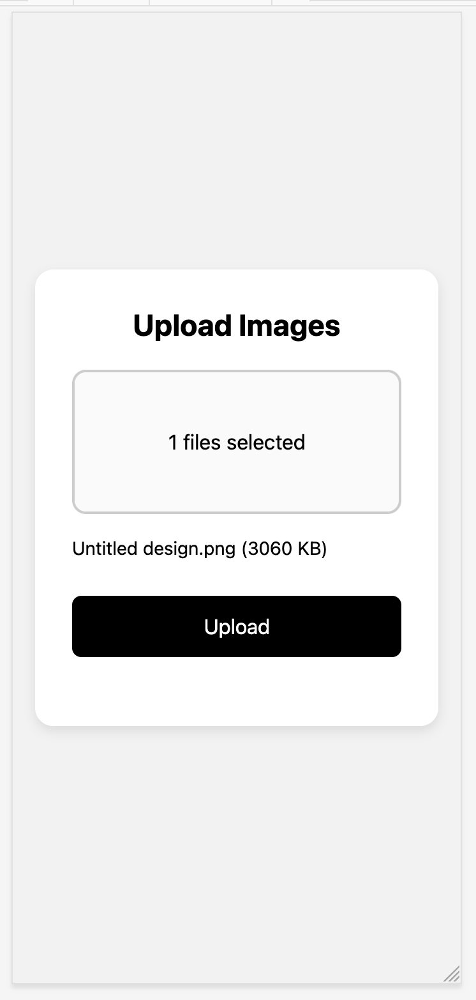
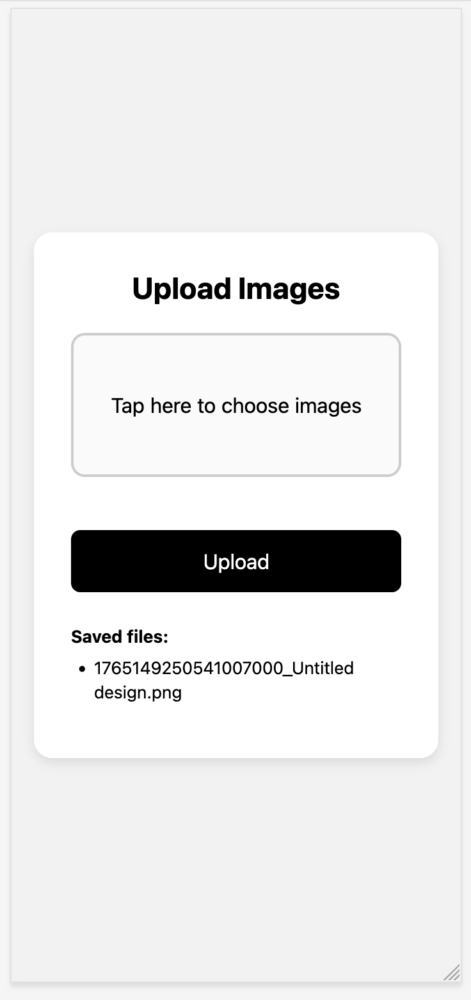
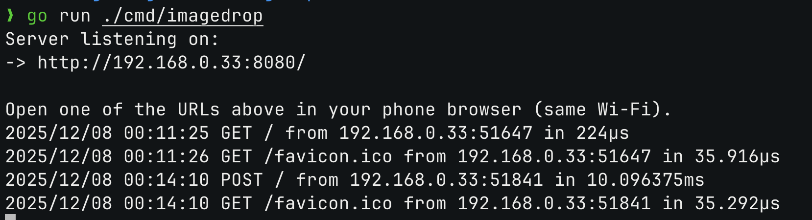

# Local Image Uploader

A Golang HTTP server that allows you to upload images from your phone to your laptop over the same Wi-Fi network.
The server runs locally and exposes a simple web interface where you can select multiple images, preview them before upload, and store them on your machine.

The UI is optimized for iPhone Safari and desktop browsers.
Multi-select from the iOS Photo Library works reliably.

---

## Features

- Runs as a single Go binary
- No external dependencies (standard library only)
- Files saved to disk with unique timestamp prefixes
- Minimal, responsive mobile UI
- Large upload button and centered layout
- iPhone-compatible multi-image selection
- Preview selected images before upload (file name + size)
- Saved file names are shown inside a styled results box
- Filenames wrap correctly (no overflow)

---

## Visual Walkthrough

### 1. Initial Screen

When you open the URL on your phone, you see the main upload card centered on the screen.
The box is fully tappable and opens the photo picker.



---

### 2. After Selecting Images (Before Upload)

When you pick one or more images from the photo library and tap **Add**, the UI updates:

- The box text changes to `1 files selected` (or `N files selected`).
- A list of selected files is shown below the box, including file name and size.
- The **Upload** button is still available.

Example with one image selected:



If you select multiple images, all of them will be listed here before you upload.

---

### 3. After Uploading – Saved Files List

When you press **Upload**, the server receives the images and saves them to disk.

- The page reloads.
- The top part returns to the empty state, ready for another upload.
- A **Saved files:** section appears inside the card.
- Each saved file name is listed and wrapped correctly so it stays inside the box.

Example after uploading one file:



The names are prefixed with a timestamp, ensuring uniqueness.

---

### 4. Files on Disk in Your Editor

On your laptop, the uploaded files are stored in the `uploads` directory.

Example view in VS Code:

- Left: project tree showing `uploads/` and your image file.
- Right: the actual image opened in the editor.

Uploaded files are stored in:

```text
./uploads/<timestamp>_<filename>.jpg
```
Each filename is prefixed with a unique timestamp to avoid collisions.


You can open the file, move it, rename it, or use it anywhere else.

---

## Running the Server

#### Requirements

- Go 1.21 or newer
- Laptop and phone must be on the same Wi-Fi network
- Works on:
  - iPhone Safari
  - Chrome (Android / Windows / macOS)
  - Firefox
  - Edge

From the project root:

```bash
go run .
```

Expected output in the terminal:

```text
Server listening on:
-> http://192.168.0.33:8080/

Open one of the URLs above in your phone browser (same Wi-Fi).
```

Example (real output):



Copy the printed URL (for example `http://192.168.0.33:8080/`) into your phone browser.

---

## Configuration (Optional)

You may configure runtime behavior using environment variables.

### Available variables

| Variable                | Description                  | Default  |
|-------------------------|------------------------------|----------|
| `IMAGEDROP_ADDR`        | Listen address/port          | `:8080`  |
| `IMAGEDROP_UPLOAD_DIR`  | Directory to save uploads    | `uploads`|
| `IMAGEDROP_MAX_UPLOAD_MB` | Max upload request size (MB) | `100`    |

### Example (PowerShell)

```powershell
$env:IMAGEDROP_ADDR=":9090"
$env:IMAGEDROP_UPLOAD_DIR="D:\photos"
$env:IMAGEDROP_MAX_UPLOAD_MB="200"

go run .
```

### Example (Windows cmd.exe)

```cmd
set IMAGEDROP_ADDR=:9090
set IMAGEDROP_UPLOAD_DIR=D:\photos
set IMAGEDROP_MAX_UPLOAD_MB=200

go run .
```

---

## Notes

- Designed for local network use only.
- Do **not** expose this server directly to the public internet.
- Upload size limit applies to the entire multipart request.
- Large files or many images may take longer to upload depending on Wi-Fi speed.
